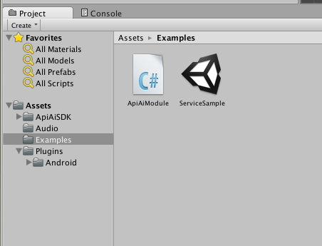
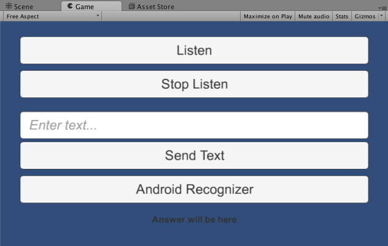
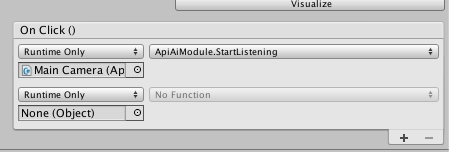

api.ai: Unity Plugin
=============

The Api.ai Unity Plugin makes it easy to integrate the [API.AI natural language processing API](http://api.ai) into your Unity project. Api.ai allows using voice commands and integration with dialog scenarios defined for a particular agent in Api.ai.

Library provides simple programming interface for making text and voice requests to the API.AI service. 

## Getting started

For using this Unity SDK you must have Unity installed on your computer. See [official website](http://unity3d.com) for details.

Also see the [sample app](https://github.com/api-ai/api-ai-unity-sample) for the example of integration.

### Installation

[Download](https://www.assetstore.unity3d.com/en/#!/content/31498) plugin bundle from the Unity Asset Store, and unpack it to the Assets folder in your project.

### Example

First, load and see **ServiceSample** scene from the API.AI bundle. 


The sample demonstrates API.AI SDK features.



* Top buttons starts and stops listening accordingly.
* With text field and **Send Text** button you can make text request to the server.
* **Android Recognizer** button demonstrates recognition option available only on Android devices 

**ApiAiModule** file contains C# code for the sample scene, take a look at methods in the module.

In `Start` method it initialize `ApiAiUnity` object with access keys.
```csharp
const string SUBSCRIPTION_KEY = "cb9693af-85ce-4fbf-844a-5563722fc27f";
const string ACCESS_TOKEN = "3485a96fb27744db83e78b8c4bc9e7b7";
var config = new AIConfiguration(SUBSCRIPTION_KEY, ACCESS_TOKEN, SupportedLanguage.English);
apiAiUnity = new ApiAiUnity();
apiAiUnity.Initialize(config);
```
and configure handlers for `OnResult` and `OnError` events
```csharp
apiAiUnity.OnError += HandleOnError;
apiAiUnity.OnResult += HandleOnResult;
```

Methods `StartListening` and `StopListening` connected to particular buttons in the scene UI.


### Create helper module

* Add new script to the Assets folder (ApiAiModule, for example) 
* Your new module should looks like
    ```csharp
    using UnityEngine;
    using System.Collections;

    public class ApiAiModule : MonoBehaviour {

        // Use this for initialization
        void Start () {
        
        }
        
        // Update is called once per frame
        void Update () {
        
        }
    }
    ```

* First, add API.AI usings

    ```csharp
    using fastJSON;
    using ApiAiSDK;
    using ApiAiSDK.Model;
    using ApiAiSDK.Unity;
    ```

* Add private field to your module to keep reference to the SDK object

    ```csharp
    private ApiAiUnity apiAiUnity;
    ```

* On the start of your module ApiAiUnity object must be initialized. Required data for initialization is keys from your development console on [api.ai](http://api.ai) service and one of supported languages

    ```csharp
    // Use this for initialization
    void Start()
    {
        const string SUBSCRIPTION_KEY = "your_subscription_key";
        const string ACCESS_TOKEN = "your_access_token";

        var config = new AIConfiguration(SUBSCRIPTION_KEY, ACCESS_TOKEN, SupportedLanguage.English);

        apiAiUnity = new ApiAiUnity();
        apiAiUnity.Initialize(config);

        apiAiUnity.OnResult += HandleOnResult;
        apiAiUnity.OnError += HandleOnError;
    }
    ```

* `OnError` and `OnResult` events used for processing service results. So, handling functions must look like

    ```csharp
    void HandleOnResult(object sender, AIResponseEventArgs e)
    {
        var aiResponse = e.Response;
        if (aiResponse != null) {
            // get data from aiResponse
        } else {
            Debug.LogError("Response is null");
        }
    }

    void HandleOnError(object sender, AIErrorEventArgs e)
    {
        Debug.LogException(e.Exception);
    }
    ```

### Usage

ApiAi Unity SDK let you to perform the following actions:

1. Start listening process and then send voice data to the api.ai service for recognition and processing
2. Send simple text request to the api.ai service
3. Use integrated Android recognition engine for recognition and send recognized text to the api.ai service for processing

#### Using API.AI recognition

To use API.AI voice recognition service you need to provide ApiAiUnity object with valid `AudioSource` object. It can be usually recieved using  `GetComponent<AudioSource>()` function.
Temporary limitation of this case is if you using API.AI recognition you need to stop listening manually. So, use this code snippets to start and stop listening.

```csharp
public void StartListening()
{
    try {
        var aud = GetComponent<AudioSource>();
        apiAiUnity.StartListening(aud);
    } catch (Exception ex) {
        Debug.LogException(ex);
    }
}

public void StopListening()
{
    try {
        apiAiUnity.StopListening();
    } catch (Exception ex) {
        Debug.LogException(ex);
    }
}
```

After start/stop listening you will receive api.ai result in the `OnResult` handler.

**Note**: In some cases Unity application must get Sound Recording priviledges for using Microphone. To do this, change your helper module Start function in the following way 

```csharp
IEnumerator Start()
{
    // check access to the Microphone
    yield return Application.RequestUserAuthorization (UserAuthorization.Microphone);
    if (!Application.HasUserAuthorization(UserAuthorization.Microphone)) {
        throw new NotSupportedException ("Microphone using not authorized");
    }

    ... // apiAiUnity initialization...
}
```

#### Simple text requests

Usage of text requests is very simple, all you need is text query.

```csharp
public void SendText()
{
    var text = "hello";
    try {
        var response = apiAiUnity.TextRequest(text);
        if (response != null) {
            // process response
        } else {
            Debug.LogError("Response is null");
        }
    } catch (Exception ex) {
        Debug.LogException(ex);
    }
}
```

**Note**, what you will receive api.ai result immediatly, not in the `OnResult` handler.

#### Using native Android recognition

This case only applicable for the Android Unity applications. You can check if the application is running on the Android platform using this simple code snippet

```csharp
if (Application.platform == RuntimePlatform.Android) {
    // you can use Android recognition here
}
```

Because of native recognition uses Unity-to-Native bridge, you need add following code to the script `Update` method. This code used for checking recognition results from native layer, because of callbacks is not supported in this case.

```csharp
if (apiAiUnity != null) {
    apiAiUnity.Update();
}
```

To start recognition process use simple call of the `StartNativeRecognition` method.

```csharp
public void StartNativeRecognition(){
    try {
        apiAiUnity.StartNativeRecognition();
    } catch (Exception ex) {
        Debug.LogException (ex);
    }
}
```

